<!-- HEADER -->

  

 

<!-- ABOUT -->

  🌱 I’m a <b>Software Engineering</b> Master's student at <a href="https://www.ua.pt/en/deti">DETI-UA</a> 
  💡 I enjoy coding, 📚 reading books, 🏊 swimming and 🎵 listening to music

  
  

 

<!-- TECH STACK -->
<h3 align="center">Tech Stack</h3>

<table align="center">
  <tr>
    <td align="center"><b>Languages</b></td>
    <td></td>
  </tr>
  <tr>
    <td align="center"><b>Frameworks</b></td>
    <td></td>
  </tr>
  <tr>
    <td align="center"><b>Data</b></td>
    <td></td>
  </tr>
  <tr>
    <td align="center"><b>Tools</b></td>
    <td></td>
  </tr>
</table>

 

<!-- GITHUB STATS -->
<h3 align="center">GitHub Stats</h3>

  
  

